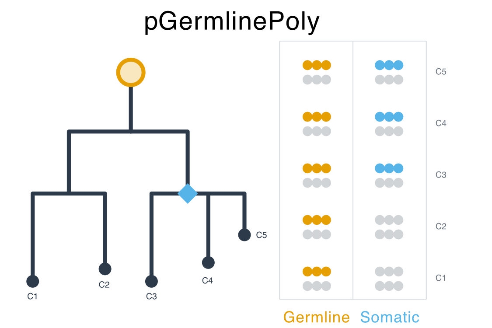

Welcome to pGermlinePoly's documentation!
==========================================

``pGermlinePoly`` is a Bayesian model to estimate the posterior probability of
germline polymorphism in somatic sequencing data. Annotation weights — capturing
how features such as population allele frequency or sequencing depth inform the
germline prior — are learned directly from the data via empirical Bayes rather
than specified by the user. The underlying EM algorithm jointly estimates these
logistic annotation weights and a Beta-Binomial error concentration parameter,
enabling data-driven discrimination between germline heterozygotes and somatic
variants.

.. toctree::
   :maxdepth: 4
   :caption: Contents:

   pGermlinePoly

Indices and tables
==================

* :ref:`genindex`
* :ref:`modindex`
* :ref:`search`
